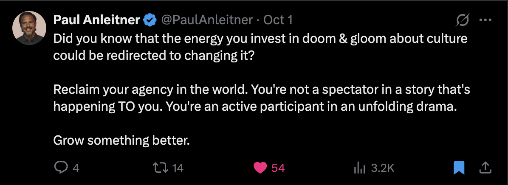
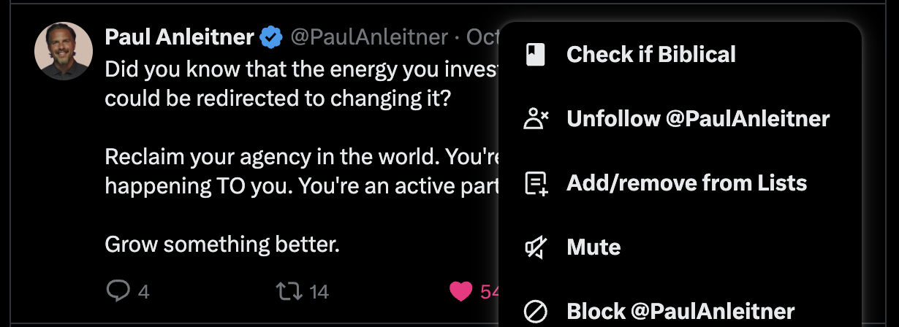
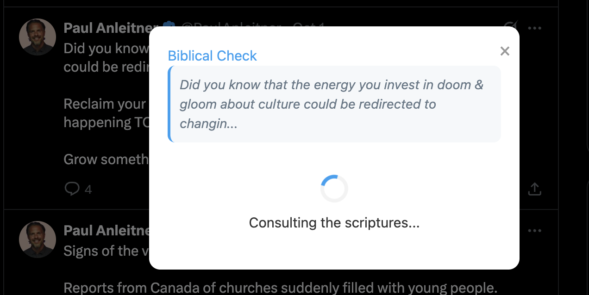
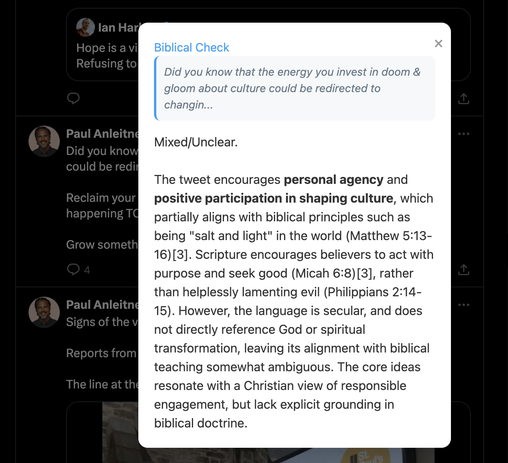

# Biblical Or Not Chrome Extension

A Chrome extension that analyzes tweets on X (formerly Twitter) to determine if they align with biblical principles using Perplexity AI.

## Features

- **Seamless Integration**: Adds a "Check if Biblical" option directly to the tweet menu (three-dot menu).
- **AI Analysis**: Uses Perplexity's `sonar-pro` model to act as a biblical scholar.
- **Instant Verdict**: Provides a "Biblical", "Not Biblical", "Mixed/Unclear", or "Unrelated/Neutral" verdict with a brief explanation.

## Screenshots

 

 

 

## Installation

1.  **Clone or Download** this repository.
2.  Open Chrome and navigate to `chrome://extensions/`.
3.  Enable **Developer mode** in the top right corner.
4.  Click **Load unpacked**.
5.  Select the folder containing this project (where `manifest.json` is located).

## Configuration

### API Key

1.  Click the **Biblical Or Not** extension icon in your Chrome toolbar.
2.  Enter your **Perplexity API Key** in the input field.
3.  Click **Save Key**.

*You can get an API key from [perplexity.ai/account/api](https://perplexity.ai/account/api).*

## Usage

1.  Go to [x.com](https://x.com).
2.  Find a tweet you want to analyze.
3.  Click the **three dots (...)** in the top right corner of the tweet.
4.  Select **Check if Biblical** from the menu.
5.  A modal will appear with the analysis.

## Files

-   `manifest.json`: Extension configuration.
-   `content.js`: Handles the UI injection into Twitter and extracting tweet text.
-   `background.js`: Handles the API calls to Perplexity to avoid CORS issues.
-   `styles.css`: Styles for the modal and menu items.
-   `popup.html`: Simple info popup (not actively used for the main feature).
